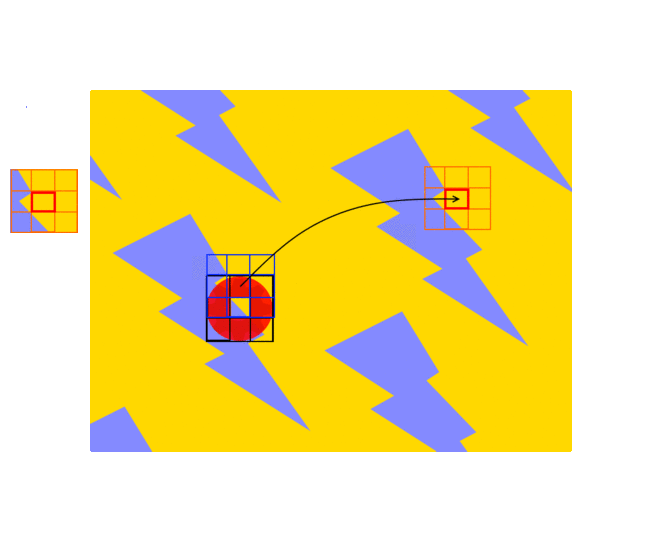

## How to inpaint?

Here are a small simple code on how to inpaint an image

```CSharp
Console.WriteLine($"Begin processing ...");
var result = inpainter.Inpaint(imageArgb, markupArgb, donors);
result
    .FromArgbToBitmap()
    .SaveTo(resultPath, ImageFormat.Png)
    .ShowFile();
```

It uses a .NET library. How it says on GitHub project page:

>Content aware fill is used to fill in unwanted or missing areas of photographs. See an example of such fill below where we don't want to have the man in blue t-shirt on our picture

